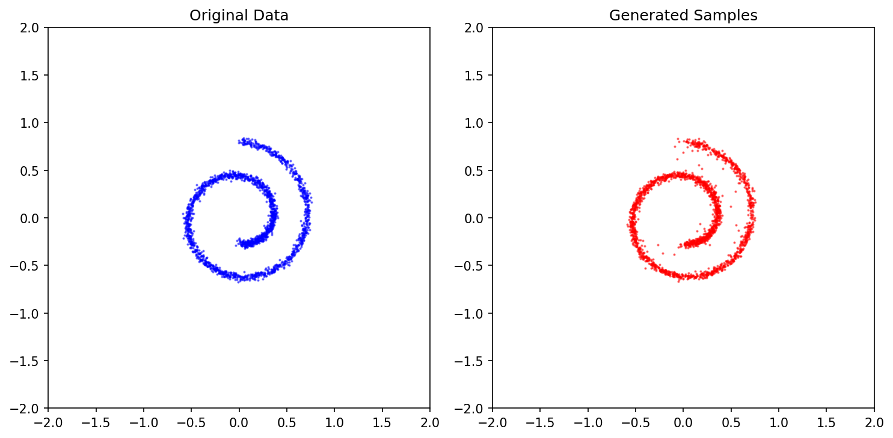
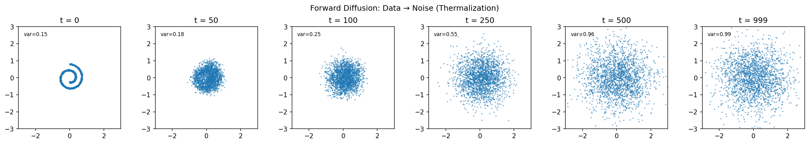
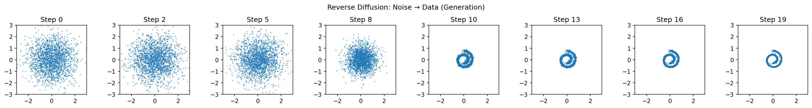
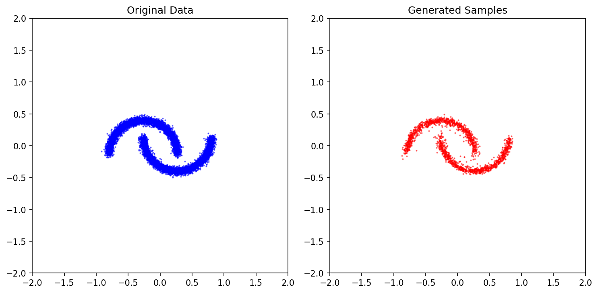
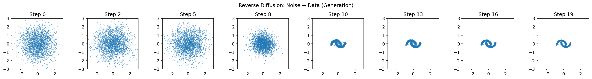

# Diffusion Model from Scratch

The idea behind this small project is for me to apply the theory of diffusion models I discovered in the amazing ENS course [From statistical physics to machine learning & back](https://www.phys.ens.psl.eu/en/cours/statistical-physics-machine-learning-back), given by Prof. Giulio Biroly and Prof. Marylou Gabrié.
It is then a pedagogical implementation of a Denoising Diffusion Probabilistic Model (DDPM) on 2D toy data, built with PyTorch and Claude Opus 4.5. The goal is to understand how diffusion models work and their deep connections to statistical physics.

## Results

### Generated Samples vs Original Data

The model learns to generate samples from a Swiss roll distribution:



### Forward Diffusion (Thermalization)

The forward process gradually adds noise, destroying structure — like a gas equilibrating:



As time increases, the structured spiral distribution converges to an isotropic Gaussian (thermal equilibrium). The variance grows from ~0.15 to ~1.0.

### Reverse Diffusion (Generation)

Starting from pure noise, the learned model guides samples back to the data distribution:



This is Langevin dynamics in action — the neural network provides the score function that points toward high-probability regions.

## Physics Connections

Diffusion models are deeply connected to non-equilibrium statistical mechanics:

### Forward Process = Ornstein-Uhlenbeck Process

The forward diffusion is a discrete approximation of:

```
dx = -β(t)/2 · x dt + √β(t) dW
```

This is **Langevin dynamics** with:
- A linear drift pulling x toward 0
- Thermal noise for exploration

After many steps, ANY initial distribution converges to N(0, I) — this is **thermalization**.

### Reverse Process = Time-Reversed Langevin Dynamics

Anderson (1982) showed that any diffusion can be reversed if we know the **score function**:

```
∇_x log p(x, t)
```

The score points toward regions of high probability density. In physics terms, it's like `-∇U / kT` where U is a free energy.

### Training = Denoising Score Matching

We learn the score by training a neural network to predict the noise that was added:

```
L = E[ ||ε_θ(x_t, t) - ε||² ]
```

The predicted noise is related to the score by:

```
∇_x log p(x_t) ≈ -ε_θ / √(1 - ᾱ_t)
```

## Code Structure

```
diffusion_2d.py
├── make_swiss_roll()          # 2D toy dataset
├── ForwardDiffusion           # Noise schedule & forward sampling
│   ├── q_sample()             # Jump to any timestep: x_t = √ᾱ_t·x_0 + √(1-ᾱ_t)·ε
│   └── visualize_forward()    # Watch thermalization
├── NoisePredictor             # MLP with time embeddings
├── train_diffusion()          # Denoising score matching
├── sample_ddpm()              # Reverse process (full)
└── sample_ddpm_fast()         # Accelerated sampling
```

## Usage

### Setup

```bash
# Create virtual environment
python -m venv venv
venv\Scripts\activate  # Windows
# source venv/bin/activate  # Linux/Mac

# Install dependencies
pip install torch numpy matplotlib
```

### Run

```bash
python diffusion_2d.py
```

This will:
1. Generate a Swiss roll dataset
2. Visualize the forward diffusion process
3. Train a noise prediction network (~8 min on CPU)
4. Generate samples via reverse diffusion
5. Save visualizations to PNG files

### Training Output

```
[5] Training (with intermediate samples every 100 epochs)...

    Epoch    Loss         Time       Progress
    --------------------------------------------------
    1        0.209474        0.6s    [--------------------] 0%
    100      0.135446       87.6s    [####----------------] 20%
    ...
    500      0.120524      472.2s    [####################] 100%
    --------------------------------------------------
    Training complete! Total time: 473.6s
```

## Key Equations

| Concept | Equation |
|---------|----------|
| Forward sampling | `x_t = √ᾱ_t · x_0 + √(1-ᾱ_t) · ε` |
| Noise schedule | `ᾱ_t = ∏_{s=1}^t (1 - β_s)` |
| Training loss | `L = E[ \|\|ε_θ(x_t, t) - ε\|\|² ]` |
| Reverse mean | `μ = (1/√α_t) · (x_t - β_t/√(1-ᾱ_t) · ε_θ)` |
| Score-noise relation | `∇ log p(x_t) ≈ -ε / √(1-ᾱ_t)` |

## Second Test: 2 Moons

To see how this architecture would perfom on a different distribution, a second test using a 2-moons shaped 2d distribution was ran.







## References

- [Ho et al., 2020 - Denoising Diffusion Probabilistic Models](https://arxiv.org/abs/2006.11239)
- [Song & Ermon, 2019 - Score-Based Generative Modeling](https://arxiv.org/abs/1907.05600)
- [Anderson, 1982 - Reverse-time diffusion equations](https://doi.org/10.1016/0304-4149(82)90051-5)

## License

MIT
